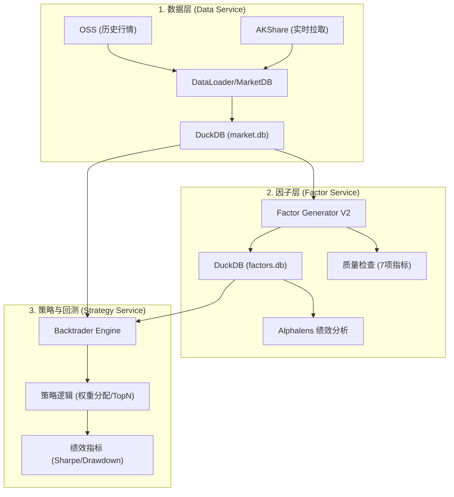

# 系统架构概览 (2026-02)

本文档提供股票回测系统的核心架构说明，旨在为后续开发提供清晰的组件关系图景。

## 1. 核心模块与职责

系统由三个核心分层组成，遵循“数据 -> 因子 -> 策略”的流转逻辑。

| 模块 | 职责 | 核心技术 | 存储方式 |
| :--- | :--- | :--- | :--- |
| **数据层 (Data)** | 获取、清洗、存储行情 (OHLCV) 与基本面数据 | AKShare, DuckDB | `market.db` |
| **因子层 (Factor)** | 计算技术指标、Alpha158、自定义因子并验证质量 | TA-Lib, Generator V2, Alphalens | `factors.db` |
| **策略/回测 (Backtest)** | 编排因子与行情，执行回测并评估绩效 | Backtrader, Custom Strategy | `results/` |

## 2. 逻辑架构图

## 3. 开发规范与入口

- **核心代码**: 位于 `src/` 下，保持生产级稳定性。
- **实验/研究**: 位于 `research/` 下，支持快速迭代和模型训练。
- **数据入口**: 统一通过 `src/data/data.py` 获取。
- **因子入口**: 统一通过 `src/factor/generator_v2/` 计算。

## 4. 后续演进 (MCP)

系统正处于向 **MCP (Model Context Protocol)** 服务转化的过程中，旨在将上述能力暴露为原子化的工具 (Tools)，使得大语言模型 (LLM) 能够自动化执行回测任务。
